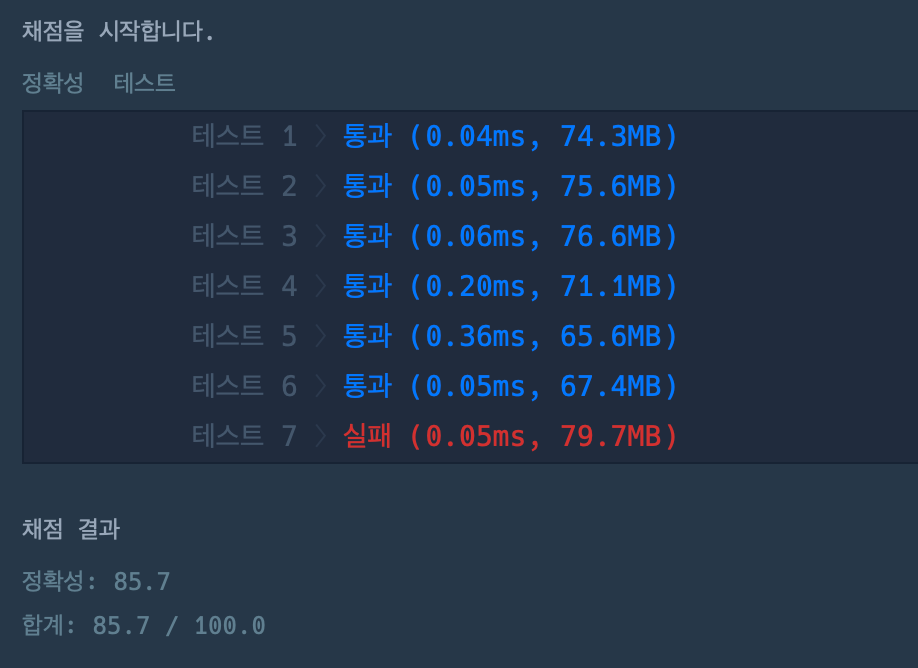

[문자열 바꿔서 찾기](https://school.programmers.co.kr/learn/courses/30/lessons/181864)
# ❌실패
```java
class Solution {
    public int solution(String myString, String pat) {
        int answer = 0;
        int strLen = myString.length();
        int patLen = pat.length();
        String changedStr = "";
        
        for(int i = 0; i < strLen; i++) {
            char c = myString.charAt(i);
            if ((Character.toString(c)).equals("A")) {
                changedStr = changedStr.concat("B");
            } else {
                changedStr = changedStr.concat("A");
            }
        }
        
        if ((strLen == patLen) && (!changedStr.equals(pat))) {
            answer = 0;
        }
        
        if (strLen > patLen) {
            for (int i = 0; i < strLen - patLen + 1; i++) {
                String subStr = changedStr.substring(i, i + patLen);
                if (subStr.equals(pat)) {
                    answer = 1;
                    break;
                }
            }
        }
        
        return answer;
    }
}
```


```java
class Solution {
public int solution(String myString, String pat) {
int answer = 0;
int strLen = myString.length();
int patLen = pat.length();
String changedStr = "";

        for(int i = 0; i < strLen; i++) {
            char c = myString.charAt(i);
            if ((Character.toString(c)).equals("A")) {
                changedStr = changedStr.concat("B");
            } else {
                changedStr = changedStr.concat("A");
            }
        }
        
        if (strLen > patLen) {
            for (int i = 0; i < strLen - patLen + 1; i++) {
                String subStr = changedStr.substring(i, i + patLen);
                if (pat.equals(subStr)) {
                    answer = 1;
                }
            }
        } else if (strLen == patLen) {
            if (!changedStr.equals(pat)) {
                answer = 0;
            } else {
                answer = 1;
            }
        }
        
        return answer;
    }
}
```

- myString 과 pat 길이 비교하는 부분에서 둘의 문자열 길이가 같은 경우를 배제하고 있어 결과값이 예상대로 나오지 않아, 로직을 수정함